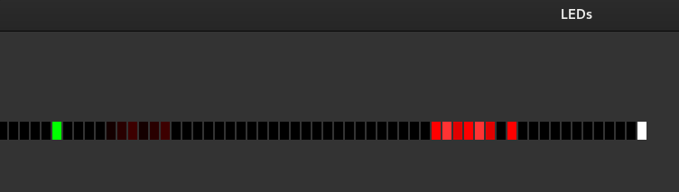

# tinygo-twang

during a visit with my son in the "computer games museeum" - [RetroGames](https://www.retrogames.info/) we found a little game with an LED strip - obviously i had to find out how this works.

after short google searh for "1D led games", the game is called `twang`  https://www.youtube.com/watch?v=RXpfa-ZvUMA

that beeing said, i decided to write my own `twang` in go, but with the limitations of tinygo in mind

currently i am testing with a 1 meter, 60 led strip, but you can easily adjust it to much longer

## entities

to make it extensible and usable as library, there is a small 1D entity engine build around it, taking care of levels, and the order of "drawing"

beside the player, who is moving and can attack, there are also usable entities, for example

* enemies, standing or walking in different directions
* fire, with active and inactive phases to pass or die
* water, flowing in a direction, pulling you with it
* the goal
* and a few more, for animations and spawning entities

## emulator

for easier development and faster iterations, i included a simple [ebiten](https://ebitengine.org/) emulator, so you don't have to constantly flash a microcontroller

